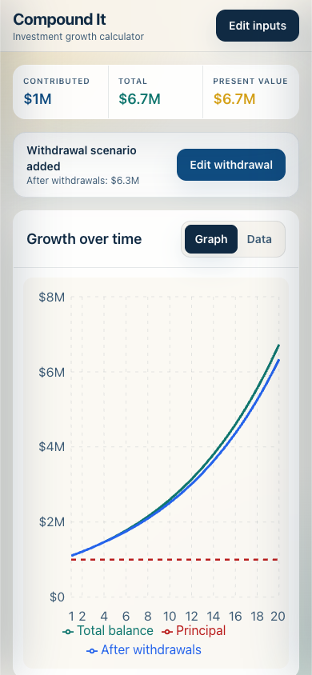

# Compound It

Compound It is a mobile-first investment growth calculator. It first builds a base compound-growth projection, then lets the user add an optional withdrawal scenario for comparison.

## Mobile preview

<p align="center">
  
</p>

## Mobile experience

- Graph-first layout with no marketing hero
- Graph and year-by-year Data tabs
- Compact result totals that stay visible above the visualization
- Data-entry form that slides in from the left
- Separate withdrawal button that appears after a base projection is available
- Withdrawal form that slides in from the right
- Third graph line comparing the base balance with the balance after withdrawals
- Additional withdrawal and adjusted-balance columns in the Data tab
- Single-line labels with mobile-friendly numeric keyboards
- One-tap historical return presets for the S&P 500, Nasdaq-100, and TQQQ
- Suggested withdrawal timing based on ending-balance impact
- Touch-sized controls, safe viewport sizing, and reduced-motion support
- Responsive desktop layout using the same focused interface

## Calculator inputs

- Initial deposit
- Annual contribution
- Inflation rate
- Years of growth
- Estimated annual return

Blank fields default to zero. Contributions are annual. Present value discounts the ending balance using the selected inflation rate.

## Withdrawal comparison

After the base projection is built, **Add withdrawal** appears below the headline results. It opens a separate drawer from the right with two inputs:

- Annual withdrawal
- Start year

Once both inputs are entered, the graph adds an **After withdrawals** line without replacing the original total-balance line. The Data tab adds the withdrawal taken that year, adjusted balance, and adjusted present value. A withdrawal is applied at the start of its year before growth.

## Historical return presets

The buttons beside the estimated return field apply nominal annual returns that include reinvested distributions:

| Preset | Annual return | Measurement |
| --- | ---: | --- |
| S&P 500 | 10.0% | Rounded long-run average since the index launched in 1957 |
| Nasdaq-100 | 14.60% | CAGR calculated from the official XNDX total-return index base value on February 1, 1985 through July 21, 2026 |
| TQQQ | 44.36% | ProShares annualized NAV total return since February 9, 2010, reported June 30, 2026 |

Sources: [Fidelity S&P 500 historical average](https://www.fidelity.com/learning-center/trading-investing/sp-500-average-return), [Nasdaq XNDX total-return index](https://indexes.nasdaq.com/Index/Overview/XNDX), and [ProShares TQQQ performance](https://www.proshares.com/our-etfs/leveraged-and-inverse/tqqq).

These figures are historical inputs, not forecasts. TQQQ targets three times the Nasdaq-100's **daily** return and carries materially different long-term risk and compounding behavior.

## Withdrawal timing guide

After an annual withdrawal is entered in the right-side drawer, the calculator tests every possible withdrawal start year. It suggests the earliest year that keeps the projected ending balance within 5% of the base projection.

The guide also shows the dollar and percentage reduction caused by the selected withdrawal start year. “Low impact” only describes the effect within this deterministic projection. It is not a safe-withdrawal recommendation because the calculator does not model market volatility, sequence-of-returns risk, taxes, or investment fees.

## Stack

- React 19
- Vite
- TypeScript
- Tailwind CSS
- Recharts
- Zod
- Vitest and Testing Library
- Playwright

## Run locally

```bash
npm ci
npm run dev
```

Vite prints the local address after startup. Open it in a browser and use responsive mode or a phone on the same network to test the mobile interface.

## Quality checks

```bash
npm run check
npm run lint
npm run test:unit
npm run test:integration
npm run build
```

Run every check with:

```bash
npm test
```

## Project structure

```text
src/
  App.tsx                    Main graph-first layout and left/right drawers
  components/
    CalculatorForm.tsx       Calculator input fields
    WithdrawalForm.tsx       Optional withdrawal scenario inputs and timing guide
    GrowthChart.tsx          Responsive balance and principal graph
    ResultsSummary.tsx       Compact headline results
    ResultsTable.tsx         Scrollable year-by-year data
    ui/                      Shared input and tab controls
  lib/
    finance.ts               Projection calculations
    input.ts                 Input parsing and formatting
tests/
  app.spec.ts                Desktop and mobile browser tests
```

## Available scripts

| Command | Purpose |
| --- | --- |
| `npm run dev` | Start the Vite development server |
| `npm run build` | Type-check and create a production build |
| `npm run check` | Run TypeScript without emitting files |
| `npm run lint` | Run ESLint |
| `npm run test:unit` | Run Vitest tests |
| `npm run test:integration` | Run Playwright tests |
| `npm test` | Run unit and browser tests |
